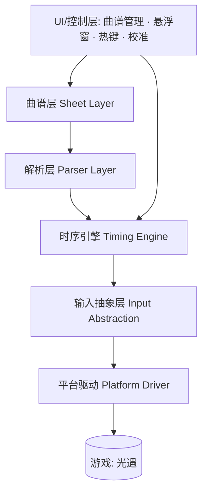
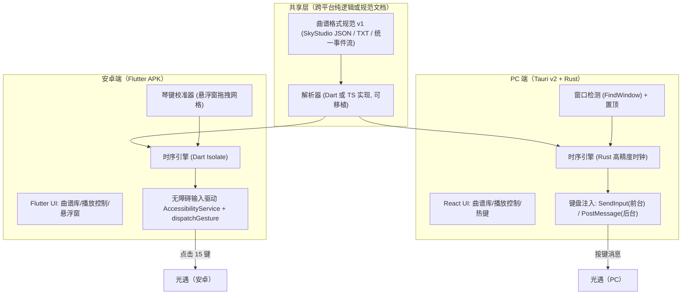

# 光遇（Sky: Children of the Light）自动弹琴脚本 —— 设计文档

> 版本：v1.0 ｜ 日期：2026-02 ｜ 适用平台：**安卓手机端 + PC 端**（iOS 及其他平台不在范围内）
>
> 本文档基于对 GitHub / Gitee 上多个开源"光遇自动弹琴"项目的调研，归纳其技术栈与设计思路，并结合目标需求（安卓 + PC 双端）给出推荐设计方案。

---

## 1. 背景与目标

光遇（Sky: Children of the Light）游戏内乐器使用 **15 键（3 行 × 5 列）** 琴键布局，玩家可通过点击琴键（移动端）或按键盘（PC 端）演奏。"自动弹琴"即：解析曲谱文件 → 按时序自动模拟点击/按键，让游戏内角色自动演奏乐曲。

### 1.1 需求范围

| 平台 | 是否支持 | 说明 |
|---|---|---|
| 安卓手机端（Android） | ✅ 必须 | 真机运行，通过无障碍/ADB 模拟点击 |
| PC 端（Windows） | ✅ 必须 | 原生游戏窗口，模拟键盘输入 |
| iOS / 模拟器 / 主机 | ❌ 不考虑 | 不在本次范围内 |

### 1.2 核心目标

1. 支持解析主流曲谱格式（SkyStudio JSON、TXT 简谱等），统一为内部事件流；
2. 高精度时序引擎：按 BPM/时间戳驱动按键，支持和弦（多键同按）、倍速、暂停/继续；
3. 平台无关的输入抽象层：Android 走无障碍点击，PC 走键盘消息注入；
4. 友好的交互：曲谱管理、悬浮窗/全局热键控制、琴键校准。

---

## 2. 开源项目调研总览

以下是调研到的主要开源项目（按平台归类）：

| 项目 | 平台 | 技术栈 | 输入模拟方式 | 曲谱格式 | 许可 |
|---|---|---|---|---|---|
| [luoy-oss/Zephyr](https://github.com/luoy-oss/Zephyr) | Android | Flutter (Dart)、Riverpod | 无障碍服务模拟屏幕点击 + 悬浮窗 | 自定义 TXT 简谱 | 自定义（禁商业/反编译） |
| [StageGuard/SkyAutoPlayerScript](https://gitee.com/stageguard/SkyAutoPlayerScript) | Android | Auto.js（JavaScript） | Auto.js 无障碍权限模拟点击 | SkyStudio 导出谱 | LGPL-2.1 |
| [jkulvich/COTLTracker](https://github.com/jkulvich/COTLTracker) | Android（主机 CLI 桥接） | Go | ADB `input tap` | Sky Music Sheet Maker / 自定义 tracker | MIT（已停止维护） |
| [yuki-sakura-chan/sky-auto-player](https://github.com/yuki-sakura-chan/sky-auto-player) | **PC + Android** | Python、pyautogui/keyboard、adb | PC 模拟键盘；Android adb 点击；demo 预览 | JSON | MIT |
| [Tloml-Starry/SkyAutoMusic](https://github.com/Tloml-Starry/SkyAutoMusic) | PC | Python、pyautogui、keyboard、psutil、pywin32、Tkinter | 模拟键盘（支持多键同按） | JSON（`songNotes`） | —（灵感源头之一） |
| [redtardis12/Sky-AutoMusic-PC](https://github.com/redtardis12/Sky-AutoMusic-PC) | PC | Python | 模拟键盘 | JSON（specy 曲谱库） | — |
| [Somansh1/auto-music-sky](https://github.com/Somansh1/auto-music-sky) | PC | Python、Tkinter | 线程安全键盘模拟（带重叠处理） | JSON/TXT（多种包裹格式） | MIT |
| [windhide/SkyMusicPlay-for-Windows](https://github.com/windhide/SkyMusicPlay-for-Windows)（星星弹琴软件） | PC / 模拟器 | Electron + TypeScript + Vite + Naive-UI + Python + **YOLO** + WebSocket | 视觉识别琴键 + 模拟按键 | 加密数字谱等（含解密逻辑） | CC BY-NC |
| [Whitewind0987/sky-music-play-lite](https://github.com/Whitewind0987/sky-music-play-lite) | PC | Tauri v2 + React + TypeScript + Rust | **后台播放**（向目标窗口 PostMessage）/ 前台 SendInput | SkyStudio JSON/TXT、加密数字谱、scores-v2 | GPL-3.0 |

> 补充说明：曲谱制作者社区常用 [SkyStudio（Maple）](https://play.google.com/store/apps/details?id=com.Maple.SkyStudio) 制谱并导出 JSON；[specy.github.io/skyMusic](https://specy.github.io/skyMusic/) 是常见的在线曲谱库。

### 2.1 调研结论

1. **没有单一开源项目能同时"原生"覆盖安卓真机 + PC**——最接近的是 `sky-auto-player`（同一 Python 代码库内切换 `win` / `android` / `demo` 三种模式）。
2. Android 端事实标准是 **无障碍服务模拟点击**（Zephyr、Auto.js 脚本）；ADB 桥接（COTLTracker）需要电脑连接手机，体验较差且已停更。
3. PC 端主流是 **Python 键盘模拟**（pyautogui/keyboard），进阶方案是 **Tauri/Rust 直接注入按键消息**（支持后台播放、更高精度），以及 **YOLO 视觉识别琴键**（不依赖固定坐标）。
4. 曲谱格式事实标准是 **SkyStudio JSON**（`songNotes: [{time, key}]`），此外存在 TXT 简谱、加密数字谱、scores-v2 等衍生格式。
5. 所有项目都强调：**仅模拟用户输入，不读写游戏内存、不注入数据包**，属于"宏"性质，与手动操作等效（但仍存在违反游戏用户协议的风险）。

---

## 3. 技术栈对比分析

### 3.1 Android 端三条技术路线

| 路线 | 代表项目 | 原理 | 优点 | 缺点 |
|---|---|---|---|---|
| **A. 无障碍服务（AccessibilityService）** | Zephyr、Auto.js 脚本 | 应用内开启无障碍服务，用 `dispatchGesture` / `GestureDescription` 在屏幕坐标上注入点击 | 无需电脑、真机直装、可悬浮窗控制 | 需用户授权无障碍+悬浮窗权限；不同 ROM 可能有兼容问题 |
| **B. ADB 桥接** | COTLTracker、sky-auto-player(android) | 电脑端程序通过 `adb shell input tap x y` 让手机执行点击 | 实现简单、不占手机权限 | 必须用数据线/无线连电脑；延迟略高；体验割裂 |
| **C. Auto.js 脚本框架** | StageGuard 脚本 | Auto.js 封装无障碍+悬浮窗+脚本语言，运行 JS 脚本 | 开发快、生态有现成脚本 | 依赖 Auto.js 宿主（新版需授权）；脚本质量参差 |

**推荐（Android）：路线 A**。Zephyr 验证了 Flutter + 无障碍点击的完整可行路径：悬浮窗覆盖在游戏上层，用户拖动校准 15 键的网格位置，播放时按坐标注入点击。

### 3.2 PC 端三条技术路线

| 路线 | 代表项目 | 原理 | 优点 | 缺点 |
|---|---|---|---|---|
| **A. Python 键盘模拟** | SkyAutoMusic、Sky-AutoMusic-PC、auto-music-sky | `pyautogui.press()` / `keyboard.send()` 模拟全局按键 | 开发快、跨平台、易改 | 需要游戏窗口在前台；系统占用快捷键时有冲突；精度受 Python 线程调度影响 |
| **B. 原生窗口消息注入（Rust/Tauri）** | sky-music-play-lite | `SendInput`（前台）或 `PostMessage(WM_KEYDOWN)`（后台，窗口无需前台） | **可后台播放**、精度高、可自动定位光遇窗口 | 需要 Rust 功底；部分游戏反后台输入 |
| **C. 视觉识别（YOLO）** | SkyMusicPlay-for-Windows | 截图→YOLO 检测琴键坐标→模拟点击/按键 | 不依赖固定键位、支持模拟器、布局自适应 | 需要 GPU/算力、识别延迟、模型维护成本高 |

**推荐（PC）：路线 B 为主、A 为备**。轻量且功能完整的参考是 `sky-music-play-lite`（Tauri v2 + Rust + React）。

### 3.3 语言与框架选型建议（双端统一）

| 方案 | 共享核心 | Android 端 | PC 端 | 备注 |
|---|---|---|---|---|
| **方案① Flutter 单仓库** | Dart 纯逻辑 | Flutter APK + 无障碍插件 | Flutter Windows 桌面 + Rust FFI 键盘注入 | 代码复用率最高，双端一套 UI 逻辑 |
| **方案② Tauri 单仓库** | TypeScript 纯逻辑 | 仅 Android WebView + 无障碍原生插件（较绕） | Tauri v2（Rust 注入）+ React | PC 体验最佳，Android 需另做壳 |
| **方案③ Python 单仓库** | Python | adb 桥接（非直装） | pyautogui/keyboard | 最快出原型，Android 体验差 |
| **方案④ 双仓库** | 共享格式规范文档 | Flutter/原生（如 Zephyr） | Tauri/Electron（如 Lite） | 各自最优，但维护两套 |

> 结合调研：若追求**双端独立最佳体验**，参照"Zephyr（Android）+ sky-music-play-lite（PC）"的组合思路，按**方案④**拆分但**共享同一曲谱格式规范**；若追求**单仓库最大复用**，选**方案①**。

---

## 4. 通用设计思路（来自调研的共性提炼）

### 4.1 五层架构

调研的所有成熟项目，本质都是以下五层：



1. **曲谱层**：曲谱文件的导入、存储、搜索、收藏（本地文件或内置库）。
2. **解析层**：把 SkyStudio JSON / TXT 简谱 / 加密谱等统一解析成**内部音符事件流**。
3. **时序引擎**：按时间戳/BPM 调度音符，处理和弦、倍速、暂停、起播延迟。
4. **输入抽象层**：定义统一接口（`tap(key)`、`press(key)`、`release(key)`），屏蔽平台差异。
5. **平台驱动**：Android = 无障碍手势点击；PC = 键盘消息注入；demo = 静默输出日志。

### 4.2 曲谱格式与统一中间表示

- **SkyStudio JSON**（事实标准，PC 项目几乎都支持）：
  ```json
  {
    "name": "Army Dreamers",
    "bpm": 120,
    "songNotes": [
      { "time": 948, "key": "1Key0" },
      { "time": 948, "key": "1Key2" }
    ]
  }
  ```
  同一 `time` 下多个 `key` = 和弦（同时按）。`key` 形如 `1Key0`（行 1，列 0，共 3×5=15 键）。
- **TXT 简谱**（Zephyr 风格）：
  ```
  1 2 3 / 4 5 6 // 7 1
  -1 -2 -3 0 / 1 2 3
  ```
  `1-7` 中音区、`-1..-7` 低音区、`+1` 高音、`0` 休止、`/` 短停顿、`//` 长停顿、`//标题` 段落标记。
- **加密数字谱 / scores-v2**：部分 PC 项目（SkyMusicPlay 系列）实现了解密与 V1→V2 格式转换，兼容度更高但工作量更大。

> **设计要点**：解析层输出统一的**事件序列**，例如
> `[{ t: 0, keys: [0, 2], hold: 100 }, { t: 300, keys: [5], hold: 100 }, ...]`
> 之后所有层（时序、驱动）只依赖这一中间表示，天然支持多格式扩展。

### 4.3 时序引擎设计（精度是核心）

从 `SkyAutoMusic` / `auto-music-sky` / `Zephyr` 可提炼以下共性参数与控制：

| 参数 | 说明 | 典型范围 |
|---|---|---|
| BPM | 曲谱自带或用户手动设置 | 30–200 |
| 速度倍率 | 整体调速 | 0.25x – 3x |
| 音符间隔/按键时长 | 每次按键按下持续毫秒数 | 50–500ms（默认约 100ms） |
| 起播延迟 | 切到游戏后的倒计时 | 0–15s |
| 相邻按键间距补偿 | 适配手机性能，防漏音 | adb 方案约 80ms |

引擎建议采用**绝对时间线 + 游标调度**（伪代码见 §6），而不是简单的 `sleep(间隔)` 累积（累积误差会越来越大）：

- 以第一个音符时间为基准，每个音符的触发时刻 = `(note.time - firstTime) × 1000 / (bpm / baseBpm) / speed`（ms）；
- 用一个单调时钟计算 `sleep(deadline - now)`，处理提前唤醒；
- 和弦 = 同一触发时刻的一组按键，需**并发按下**（PC 端多线程/多条消息，Android 端一次手势多点或极短间隔多次点击）。

### 4.4 输入模拟与校准

**Android 校准**（Zephyr 的核心体验）：
- 悬浮窗（`TYPE_APPLICATION_OVERLAY`）覆盖在游戏上方；
- 用户把"校准网格"拖到与游戏内 15 键对齐（行距/列距/整体偏移）；
- 校准结果（各键中心坐标）持久化（Zephyr 用 SharedPreferences），换分辨率重校。

**PC 校准**：
- 音符 → 键盘按键映射表（可编辑，如 `note_to_key` 字典）；
- 窗口自动检测与置顶（pywin32 `FindWindow` + `SetWindowPos`）；
- 进阶（YOLO 方案）：截图识别琴键坐标，再映射为屏幕点击或按键。

### 4.5 UI 与交互层

- 曲谱管理：内置曲谱 + 本地导入 + 拖拽 + 搜索 + 收藏 + 歌单/分页（Lite 最完整）；
- 播放控制：播放/暂停/继续/停止/下一首/进度条/倍速/音符间隔；
- 控制方式：Android 悬浮球面板（游戏内不切屏）；PC 全局热键（默认 F4/F5/F7、可自定义）；
- 附加功能：演奏录制（把手动演奏转成曲谱）、运行日志、自动更新。

### 4.6 安全与合规（所有开源项目的一致立场）

- 仅模拟点击/按键，**不读内存、不注入、不改包**，性质等同宏；
- 作者普遍声明：仅限学习娱乐，用户需自行承担违反游戏用户协议（ToS）导致封号的风险；
- 有的项目（Zephyr）附带严格许可声明（禁商业、禁反编译）；`SkyMusicPlay-for-Windows` 为 CC BY-NC。

---

## 5. 推荐设计方案（目标：安卓真机 + PC 双端）

### 5.1 总体架构（推荐方案④：共享规范、双端独立实现）



### 5.2 模块划分与职责

| 模块 | 职责 | 关键设计 |
|---|---|---|
| **格式规范模块** | 定义曲谱文件格式与统一事件流 JSON | 兼容 SkyStudio JSON；提供 TXT→事件流转换；预留 scores-v2 解密接口 |
| **解析器** | 文件 → 事件序列 | 纯函数、可单测；支持 BPM 覆盖、移调（transpose） |
| **时序引擎** | 事件流 → 按时触发回调 | 绝对时间线游标；倍速；和弦并发；暂停/继续/停止/seek；起播倒计时 |
| **输入驱动（抽象）** | `tap(key) / press / release / chord` | 接口化，两端各一个实现 |
| **Android 驱动** | 无障碍手势点击 | `GestureDescription` 单点/多点；按校准坐标 |
| **PC 驱动** | 键盘消息注入 | 前台 `SendInput`；后台 `PostMessage`（WM_KEYDOWN/UP，lParam 构造虚拟键码） |
| **校准模块** | 生成 15 键坐标/键位映射 | Android：悬浮窗拖拽网格，持久化坐标；PC：可编辑映射表 + 窗口自动定位 |
| **UI/控制** | 曲谱库、播放控制、悬浮窗/热键、设置 | 参考 Lite 的曲谱管理 + Zephyr 的悬浮窗体验 |
| **录制（可选）** | 手动演奏 → 曲谱 | 记录点击/按键时间戳，导出 SkyStudio JSON |

### 5.3 安卓端实现要点

1. 权限：`无障碍服务`（必） + `悬浮窗`（控制面板/校准）+ 存储（曲谱导入）；
2. 无障碍服务中重写 `onAccessibilityEvent` 无需处理事件，主要提供 `dispatchGesture` 注入点击：
   ```dart
   // Flutter 侧通过 MethodChannel 调原生
   GestureDescription.Builder()
     .addStroke(StrokeDescription(Point(x, y), 0, duration))
     .build();
   accessibilityService.dispatchGesture(gesture, callback, handler);
   ```
3. 悬浮窗用 `WindowManager` + `TYPE_APPLICATION_OVERLAY`，绘制 3×5 校准网格并实时输出各键中心坐标；
4. 时序引擎放 `Isolate`，避免 UI 卡顿导致节奏抖动；点击间隔补偿参数可调（参考 80ms 起步）。

### 5.4 PC 端实现要点

1. 窗口定位：`FindWindow`/`EnumWindows` 按标题匹配光遇窗口，`SetWindowPos(HWND_TOPMOST)` 置顶；
2. 前台播放：`SendInput` 发送 `KEYBDINPUT`（scancode），注意游戏若需要管理员权限则本程序也应请求管理员权限（Lite 的做法）；
3. 后台播放（推荐）：`PostMessage(hwnd, WM_KEYDOWN, vk, lParam)` 直接投递到游戏窗口，**无需前台**；提供"组合按键兼容"开关适配不同游戏引擎；
4. 高精度时钟：Rust 侧用 `std::time::Instant` + `spin/thread::sleep` 混合，目标抖动 < 5ms；
5. 全局热键：`RegisterHotKey`（前台注册）或 keyboard hook。

### 5.5 统一事件流格式（建议 v1）

```json
{
  "version": 1,
  "name": "曲名",
  "bpm": 120,
  "speed": 1.0,
  "events": [
    { "t": 0,    "keys": [0, 2], "hold": 100 },
    { "t": 250,  "keys": [5],    "hold": 100 },
    { "t": 500,  "keys": [],     "hold": 0 }
  ]
}
```
- `keys`：0–14 表示 15 键索引（行优先：第 0 行第 0 列 = 0 … 第 2 行第 4 列 = 14）；
- `t`：相对首音的毫秒时间（已含 BPM/倍速折算，引擎不再缩放，除非实时调速）；
- `hold`：按住时长 ms，`0` 表示点按；
- 空 `keys` 事件 = 休止/停顿。

---

## 6. 关键技术伪代码

### 6.1 解析器（SkyStudio JSON → 事件流）

```text
function parseSkyStudioJson(raw, opts):
    doc = json.loads(raw)
    bpm = doc.get("bpm", opts.bpm or 120)
    notes = groupBy(doc.songNotes, by = time)          // 同 time 合并为和弦
    events = []
    baseTime = min(notes.keys())
    for time, items in sorted(notes.items()):
        keys = [keyToIndex(n.key) for n in items]       // "1Key0" → 0
        events.append({
            t: (time - baseTime) * 60_000 / bpm / opts.speed,
            keys: keys,
            hold: opts.holdMs
        })
    return events
```

### 6.2 时序引擎（绝对时间线游标）

```text
function run(events, driver, ctrl):                 // ctrl: pause/resume/stop/seek
    clock = MonotonicClock()
    startAt = clock.now() + ctrl.countdownMs
    i = 0
    while i < len(events):
        waitFor(ctrl)                                // 暂停/继续
        if ctrl.stopped: return
        ev = events[i]
        deadline = startAt + ev.t * ctrl.playbackScale
        sleepUntil(deadline)                         // sleep(deadline - now) 不累积误差
        if ctrl.stopped: return
        for key in ev.keys: driver.press(key)        // 和弦：并发触发
        scheduleRelease(ev.keys, ev.hold)            // 独立线程/异步定时释放
        i += 1
```

### 6.3 Android 无障碍点击（关键片段）

```kotlin
// GestureDescription 构造单点点击（坐标来自校准结果）
val stroke = StrokeDescription(PointF(x, y), 0, holdMs)
val gesture = GestureDescription.Builder().addStroke(stroke).build()
accessibilityService.dispatchGesture(gesture, null, null)
```

### 6.4 PC 键盘注入（后台播放，PostMessage）

```rust
// 目标窗口句柄 hwnd，虚拟键码 vk
PostMessageW(hwnd, WM_KEYDOWN, vk as WPARAM, lparam as LPARAM);
PostMessageW(hwnd, WM_KEYUP,   vk as WPARAM, lparam as LPARAM);
// lparam 需按 MSDN 构造：repeatCount | scanCode<<16 | extendedKey<<24 ...
```

---

## 7. 风险与对策

| 风险 | 影响 | 对策 |
|---|---|---|
| 节奏精度不足（线程调度抖动） | 演奏卡顿/难听 | 绝对时间线 + 高精度时钟；Android 用 Isolate，PC 用 Rust 侧调度 |
| 手机分辨率/全面屏差异 | 点击位置偏移 | 悬浮窗可视化校准 + 坐标持久化；支持横竖屏两套校准 |
| 游戏窗口标题/进程变化 | PC 找不到窗口 | 模糊匹配 + 手动选择窗口（Lite 做法） |
| 游戏后台不响应 PostMessage | 后台播放失效 | 提供前台播放回退 + 组合按键兼容开关 |
| 无障碍权限被 ROM 限制 | Android 无法点击 | 兼容 Auto.js/ADB 作为备选驱动；文档说明各 ROM 授权路径 |
| 违反游戏 ToS 封号 | 账号风险 | 明确免责声明；仅模拟输入不碰内存；建议小号试用 |
| 曲谱格式加密/更新 | 解析失败 | 解析层插件化，预留解密模块（参考 scores-v2 解密） |
| 开源许可/版权 | 法律风险 | 参考项目许可各异（MIT/LGPL/GPL/CC BY-NC/自定义），借鉴前先确认许可；UI/内置曲谱单独授权 |

---

## 8. 开发路线图（建议）

| 阶段 | 内容 | 里程碑 |
|---|---|---|
| **P0 原型（1–2 周）** | 定曲谱规范；Python 或 Dart 单端 demo 播放一首内置曲 | 端到端能响 |
| **P1 安卓端（2–3 周）** | Flutter 壳 + 无障碍驱动 + 悬浮窗校准 + 曲谱导入 | APK 可演奏多曲 |
| **P2 PC 端（2–3 周）** | Tauri/Rust 壳 + 窗口检测 + 前台/后台注入 + 热键 | 双端可用 |
| **P3 完善（持续）** | 录制、倍速/移调、多格式（scores-v2）、模拟器适配、自动更新 | v1.0 发布 |

---

## 9. 参考资料

- Zephyr：https://github.com/luoy-oss/Zephyr
- SkyAutoPlayerScript（Auto.js 脚本）：https://gitee.com/stageguard/SkyAutoPlayerScript
- COTLTracker：https://github.com/jkulvich/COTLTracker
- sky-auto-player（PC + Android 双模式）：https://github.com/yuki-sakura-chan/sky-auto-player
- SkyAutoMusic（PC，灵感源头）：https://github.com/Tloml-Starry/SkyAutoMusic
- Sky-AutoMusic-PC：https://github.com/redtardis12/Sky-AutoMusic-PC
- auto-music-sky：https://github.com/Somansh1/auto-music-sky
- SkyMusicPlay-for-Windows（星星弹琴软件，YOLO 视觉方案）：https://github.com/windhide/SkyMusicPlay-for-Windows
- SkyMusicPlay Lite（Tauri 后台播放）：https://github.com/Whitewind0987/sky-music-play-lite
- 曲谱库：https://specy.github.io/skyMusic/ ｜ SkyStudio（制谱）：https://play.google.com/store/apps/details?id=com.Maple.SkyStudio

---

*本文档为调研与设计参考，落地前请自行确认各开源项目的许可条款与游戏用户协议。*

---

## 附录 A：建议的项目结构（Monorepo）

```
sky-autoplayer/
├─ packages/
│  ├─ core/                  # 共享核心（解析 + 时序，纯逻辑、可单测）
│  │  ├─ src/parser/         # skystudio_json.ts / txt.ts / events.ts
│  │  ├─ src/engine/         # timeline.ts / scheduler.ts / player.ts
│  │  └─ src/types.ts        # SheetMeta / NoteEvent / PlaybackConfig / InputDriver
│  ├─ android_app/           # Flutter 壳（对应 Zephyr 思路）
│  │  ├─ lib/ui/             # 曲谱库 / 播放控制 / 悬浮窗 / 校准
│  │  ├─ lib/services/       # accessibility_bridge.dart（MethodChannel）
│  │  └─ android/src/main/kotlin/.../SkyAccessibilityService.kt
│  └─ pc_app/                # Tauri v2 + React + Rust（对应 Lite 思路）
│     ├─ src/                # React UI（曲谱库、播放、热键设置）
│     └─ src-tauri/src/      # window.rs / inject.rs / hotkey.rs
├─ sheets/                   # 曲谱资源（注意内置谱的授权）
├─ docs/design.md
└─ README.md
```

## 附录 B：关键代码骨架

### B.1 统一类型定义

```ts
interface SheetMeta { name: string; bpm: number; }
interface NoteEvent  { t: number; keys: number[]; hold: number; } // t: ms 相对首音

interface PlaybackConfig {
  speed: number;        // 0.25 – 3
  holdMs: number;       // 默认 100
  countdownMs: number;  // 0 – 15000
  transpose: number;    // 移调半音数（可选）
}

interface InputDriver {
  press(keys: number[]): void;    // 和弦按下（同一触发时刻的一组键）
  release(keys: number[]): void;  // 释放
  dispose(): void;
}
```

### B.2 Android 无障碍驱动（Kotlin，经 MethodChannel 暴露给 Flutter）

```kotlin
class SkyAccessibilityService : AccessibilityService() {
    fun tap(x: Float, y: Float, holdMs: Long) {
        val stroke = StrokeDescription(Path().apply { moveTo(x, y) }, 0, holdMs)
        val gesture = GestureDescription.Builder().addStroke(stroke).build()
        dispatchGesture(gesture, null, null)
    }
}
// Flutter 侧：
// MethodChannel("sky/accessibility").invokeMethod("tap", {"x": x, "y": y, "hold": hold})
```

### B.3 PC 后台按键注入（Rust + windows crate）

```rust
use windows::Win32::UI::WindowsAndMessaging::*;

pub fn send_key(hwnd: HWND, vk: u16, down: bool) {
    let lparam = 1u32                      // repeat count
        | ((vk as u32) << 16)              // scan code（正式实现用 MapVirtualKeyW 生成）
        | if down { 0 } else { 1 << 30 };  // key-up 标志
    unsafe {
        let _ = PostMessageW(hwnd, if down { WM_KEYDOWN } else { WM_KEYUP },
                             WPARAM(vk as usize), LPARAM(lparam as isize));
    }
}
// 前台播放备用：SendInput(KEYBDINPUT)，需与本进程权限一致（必要时请求管理员权限）
```

### B.4 解析器：TXT 简谱 → 事件流

```ts
// 输入示例："1 2 3 / -1 0 // +1"
export function parseTxt(sheet: string, cfg: PlaybackConfig): NoteEvent[] {
  const events: NoteEvent[] = [];
  let t = 0;
  for (const tok of sheet.split(/\s+/)) {
    if (tok === "/")  { t += 200; continue; }   // 短停顿
    if (tok === "//") { t += 500; continue; }   // 长停顿
    if (tok.startsWith("//")) continue;         // 段落标题
    const key = noteToKey(tok);                 // "1"→7, "-1"→0, "+1"→14, "0"→null(休止)
    events.push({ t, keys: key === null ? [] : [key], hold: cfg.holdMs });
    t += (60000 / cfg.bpm) / 4 * cfg.speed;     // 默认四分音符
  }
  return events;
}
```

### B.5 共享配置文件示例（`shared_config.json`）

```json
{
  "android": {
    "layoutRows": 3, "layoutCols": 5, "tapIntervalMs": 80,
    "calibration": { "originX": 0, "originY": 0, "colGap": 96, "rowGap": 96 }
  },
  "pc": {
    "windowTitlePattern": "Sky",
    "playMode": "background",
    "noteToKey": { "0": "A", "1": "S", "2": "D", "3": "F", "4": "G",
                   "5": "H", "6": "J", "7": "K", "8": "L",
                   "9": "Q", "10": "W", "11": "E", "12": "R", "13": "T", "14": "Y" },
    "hotkeys": { "play": "F4", "pause": "F5", "stop": "F6" }
  }
}
```

## 附录 C：权限与依赖清单

**Android（manifest）**

```xml
<uses-permission android:name="android.permission.SYSTEM_ALERT_WINDOW" />
<uses-permission android:name="android.permission.READ_EXTERNAL_STORAGE"
                 android:maxSdkVersion="32" />
<!-- Android 11+ 曲谱导入推荐用 SAF（ACTION_OPEN_DOCUMENT），免存储权限 -->
<service android:name=".SkyAccessibilityService"
         android:permission="android.permission.BIND_ACCESSIBILITY_SERVICE"
         android:exported="false">
  <intent-filter>
    <action android:name="android.accessibilityservice.AccessibilityService" />
  </intent-filter>
  <meta-data android:name="android.accessibilityservice"
             android:resource="@xml/accessibility_service_config" />
</service>
```

**PC（Rust Cargo 依赖）**

```toml
[dependencies]
windows = { version = "0.5x", features = ["Win32_UI_WindowsAndMessaging",
                                          "Win32_UI_Input_KeyboardAndMouse",
                                          "Win32_Foundation"] }
# 可选：image + 推理框架（YOLO 琴键识别，对标 SkyMusicPlay-for-Windows）
```

## 附录 D：最小可用版本（MVP）验收标准

1. 能导入一首 SkyStudio JSON 曲谱并解析为事件流（单测通过）；
2. Android 端：授权后，悬浮窗校准 15 键，播放内置曲目，音准可接受（无漏音/错位）；
3. PC 端：自动定位光遇窗口，后台播放一首曲目，节奏误差 < 10ms（对拍观察）；
4. 播放中可暂停/继续/停止，可实时调速（0.5x / 1x / 2x）；
5. 双端共用同一份曲谱文件与配置 schema。
