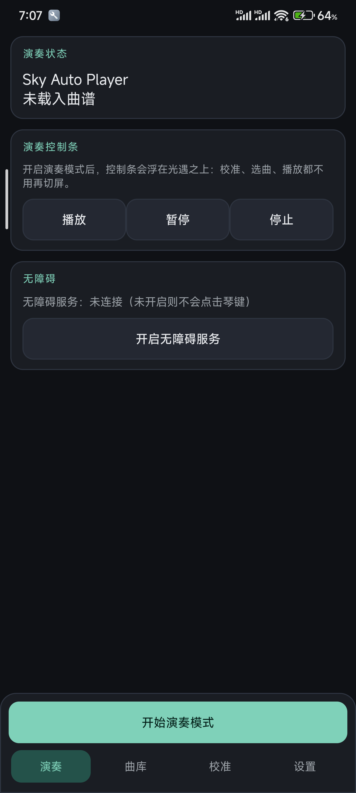
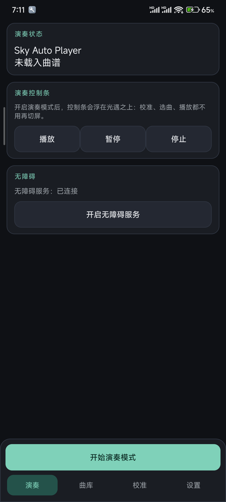
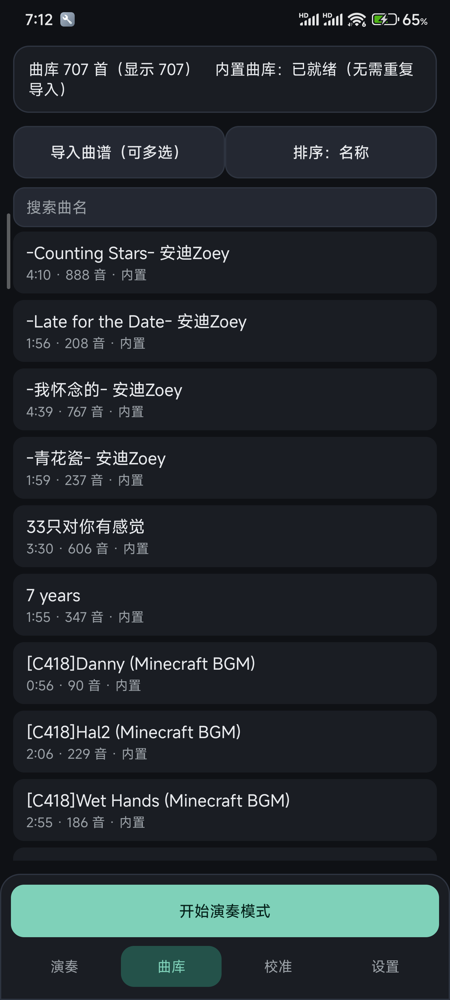
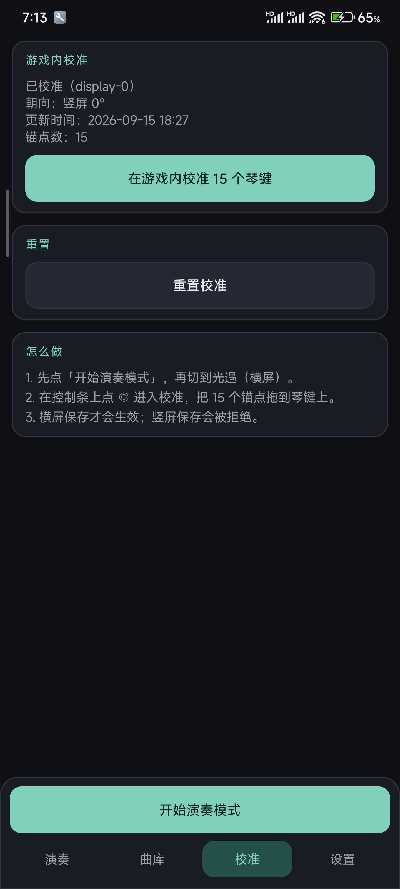
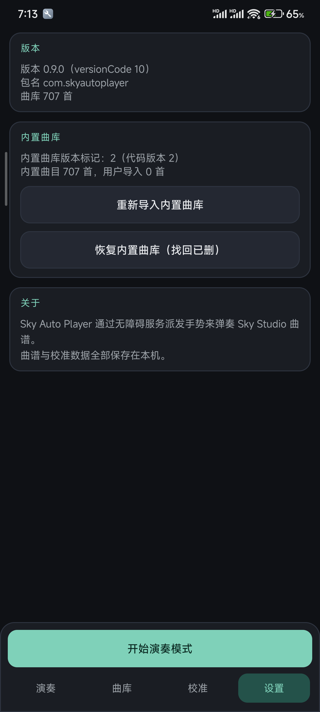

# 使用说明

Sky Auto Player 通过**无障碍服务**模拟点击，在光遇里自动弹奏琴谱。它不读取游戏内存、不注入游戏进程，只代替你的手指点按琴键。

> 本说明中的截图取自小米 22041211AC（Android 14，1440×3200），App 版本 0.9.0。

---

## 一、首次准备（只需做一次）

### 1. 开启无障碍服务

打开 App → **「演奏」** 页 → 点 **开启无障碍服务** → 在系统列表里找到 **Sky Auto Player** 并打开。

没开启这一项，播放时**不会有任何点击发生**。状态会直接显示在「演奏」页的**无障碍**卡片里。

**无障碍：未连接**

**无障碍：已连接**

手机重启、系统更新或重装 App 后，这项**可能被系统自动关掉**，需要重新开启。

### 2. 允许显示悬浮窗

点 **开始演奏模式** 时若弹出悬浮窗权限申请 → 选择 **去开启** ，在悬浮窗权限列表找到**SkyAutoPlayer**并授予权限。

---

## 二、自动弹琴怎么用

### 第 1 步：选曲

进入 **「曲库」** 页，点一首曲子即可载入（**只载入，不会立刻播放**）。首次安装内置 707 首。

顶部一排是「导入曲谱（可多选）」「排序」「搜索曲名」，下面每首显示 **时长 · 音符数 · 来源**（内置 / 用户导入）。

### 第 2 步：开启演奏模式

回到 **「演奏」** 页，点绿底的 **开始演奏模式**。屏幕上会出现一条**悬浮控制条**。

上图就是控制条浮在光遇之上的实际效果（横屏）。它很窄，不会挡住下方的琴键；最右侧显示当前曲名，未选曲时显示「未载入曲谱」。

### 第 3 步：切到光遇并横屏

控制条会一直浮在游戏之上，**之后校准、选曲、播放都不用再切回 App**。

### 第 4 步：校准 15 个琴键

在光遇里打开弹琴界面（让 15 个琴键露出来），然后在控制条上点 **◎（校准）**，把 15 个锚点拖到对应琴键上，点 **保存**。

> ① 必须**横屏**保存，竖屏会被拒绝（否则游戏里坐标会错位）。
> ② 换分辨率、旋转方向或游戏 UI 布局变了，都要重新校准。

### 第 5 步：播放

回到控制条点 **▶（播放/暂停）** 开始弹奏。再点一次暂停，点 **■** 停止。

---

## 三、界面与按键说明

### 主界面底部四个标签

| 标签 | 作用 |
|---|---|
| **演奏** | 状态总览：当前曲目、播放控制（播放/暂停/停止）、无障碍连接状态、开始演奏模式入口 |
| **曲库** | 曲目列表：搜索、排序、导入曲谱、多选删除 |
| **校准** | 游戏内 15 键校准入口，以及重置校准 |
| **设置** | 版本信息、内置曲库维护 |

### 绿色 = 主操作按钮

界面里**绿底**的按钮是当前页面最该点的那个：

| 绿色按钮 | 位置 | 作用 |
|---|---|---|
| **开始演奏模式** | 演奏页底部（每页都有） | 拉起悬浮控制条。开完就能切到光遇 |
| **在游戏内校准 15 个琴键** | 校准页 | 打开校准浮层（等同于控制条上的 ◎） |

### 演奏页的播放控制

| 按钮 | 作用 |
|---|---|
| **播放** | 从头播放当前载入的曲子 |
| **暂停** | 暂停在当前音符位置，可恢复 |
| **停止** | 停止播放并回到开头 |

### 悬浮控制条上的按钮

从左到右依次是：

| 图标 | 名称 | 作用 |
|---|---|---|
| ⊖ | **最小化** | 把控制条缩成一个小圆球，避免挡住琴键；再点圆球展开 |
| ⏮ | **上一首** | 切到队列里的上一首 |
| ▶ | **播放/暂停** | 播放；播放中点击变为暂停 |
| ■ | **停止** | 停止播放 |
| ⏭ | **下一首** | 切到队列里的下一首 |
| ☰♪ | **曲目** | 展开曲目面板，可翻页选曲；面板展开时可以**打字搜索**曲名 |
| ⚓ | **校准** | 进入 15 键校准浮层 |

> 整条控制条**可以用手指拖到任意位置**；缩成圆球后也能拖。位置会被记住。

### 曲目面板里

| 控件 | 作用 |
|---|---|
| **曲名输入框** | 搜索曲名 / 文件名，大小写不敏感 |
| **清除** | 清空搜索内容 |
| **✕** | 关闭搜索并退出输入状态 |
| **◀ 上一页 / 下一页 ▶** | 翻页（每页 8 首） |

### 校准页

| 控件 | 作用 |
|---|---|
| **在游戏内校准 15 个琴键** | 进入校准浮层 |
| **重置校准** | 删除当前屏幕的校准数据 |
| 状态区 | 显示是否已校准、朝向、更新时间、锚点数 |

**校准浮层里**的按钮：

| 按钮 | 作用 |
|---|---|
| **测试点击** | 按当前锚点实际点一次，确认位置对不对 |
| **保存** | 保存校准（**仅横屏可保存**） |
| **退出校准** | 不保存直接离开 |

### 设置页

| 控件 | 作用 |
|---|---|
| **版本** 卡片 | 显示版本号、包名、曲库总数 |
| **重新导入内置曲库** | 强制重新播种内置曲目 |
| **恢复内置曲库（找回已删）** | 找回你之前手动删掉的内置曲目 |

---

## 四、常见问题

**播放了但游戏里没反应**
无障碍服务没开，或系统更新 / 重装后把它关掉了。回「演奏」页看无障碍状态，显示「未连接」就重新开启一次。

**点错琴键位置**
校准不准。在光遇**横屏**下重新校准并保存；换设备或改分辨率后必须重做。

**控制条挡到琴键了**
点 **⊖** 缩成小圆球，或者直接把它拖到别处。

**某首曲子没声音 / 报错**
曲谱解析失败或没有音符。换一首试，或重新导入该曲谱。

**曲目面板打不开输入法**
面板刚展开时需要一点时间取得焦点，稍等再点输入框。

**内置曲库不见了**
「设置」页 → **重新导入内置曲库**。若是手动删过想找回 → **恢复内置曲库（找回已删）**。

---

## 五、说明

- 曲谱与校准数据**只保存在本机**，不会上传。
- 本工具仅模拟输入，不修改游戏客户端。请遵守游戏服务条款，不要用于影响他人游戏体验的场景。
